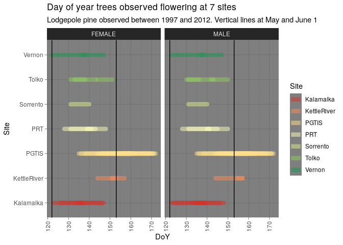

<!-- README.md is generated from README.Rmd. Please edit that file -->

# flowers

<!-- badges: start -->

<!-- badges: end -->

The goal of flowers is to provide a lodgepole pine flowering phenology
dataset in an accessible format. This package contains 15 years of
lodgepole pine (Pinus contorta var. latifolia) phenology data for pollen
shed and cone receptivity. The data were collected in seed orchards in
British Columbia and represents multiple BC provenances.

## Installation

<!--
You can install the released version of flowers from [CRAN](https://CRAN.R-project.org) with:

``` r
install.packages("flowers")
```
-->

You can install the development version of flowers from
[GitHub](https://github.com/) with:

``` r
# install.packages("devtools")
devtools::install_github("scisus/flowers")
```

## Example

Read in phenology dataset from the package.

``` r
library(flowers)
## basic example code

phendat <- flowers::phenology
head(phendat)
#>   Index DoY Phenophase    Sex Year  Site Orchard Clone Tree X  Y      Date
#> 1   355 148          4 FEMALE 1997 PGTIS     220   980   28 D 47 1997-5-28
#> 2   355 150          4 FEMALE 1997 PGTIS     220   980   28 D 47 1997-5-30
#> 3   355 153          4 FEMALE 1997 PGTIS     220   980   28 D 47  1997-6-2
#> 4   355 155          - FEMALE 1997 PGTIS     220   980   28 D 47  1997-6-4
#> 5   355 157          - FEMALE 1997 PGTIS     220   980   28 D 47  1997-6-6
#> 6   355 159          - FEMALE 1997 PGTIS     220   980   28 D 47  1997-6-8
#>        Source First_RF Last_RF Phenophase_Derived
#> 1 Rita Wagner      148     153                  2
#> 2 Rita Wagner      148     153                  2
#> 3 Rita Wagner      148     153                  2
#> 4 Rita Wagner      148     153                  3
#> 5 Rita Wagner      148     153                  3
#> 6 Rita Wagner      148     153                  3
```

Lodgepole pine in BC generally flowers in May and June.



Data is from 260 clones in 17 orchards grown at 7 BC seed orchard sites
and observed between 1997 and 2012.
